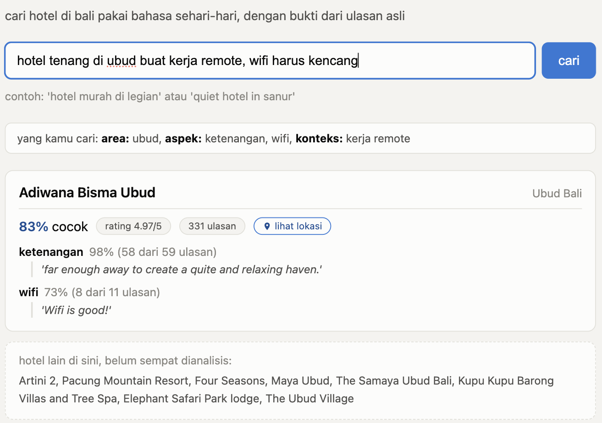
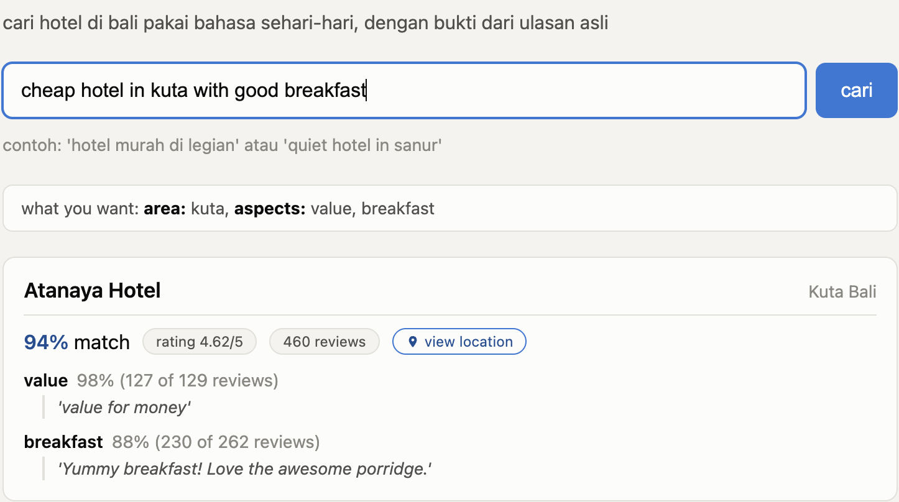

# Nginep

Cari hotel di Bali pakai bahasa sehari-hari. Ketik yang kamu butuhkan, dapatkan hotel yang diurutkan dengan bukti nyata dari ulasan asli.

Coba sekarang: **https://nginep-610631276830.asia-southeast2.run.app**

## Kenapa project ini dibuat

Pencarian hotel biasanya cuma checkbox. Yang orang benar-benar mau adalah sesuatu yang lebih spesifik, seperti 'hotel tenang di Ubud buat kerja remote, wifi kencang'. Baca ratusan ulasan sendiri buat mengecek itu butuh waktu lama. Nginep yang membaca semuanya untukmu, dan menunjukkan kutipan asli sebagai bukti, bukan ringkasan karangan.

Dibangun sebagai produk yang benar-benar jalan dan bisa dicoba langsung, bukan cuma cerita di slide: ekstraksi terstruktur berbasis LLM, ranking yang diuji dengan metodologi yang jelas, dan evaluasi yang dilaporkan apa adanya, termasuk saat hasilnya tidak sempurna.

## Buat siapa project ini

- Siapa saja yang mau liburan ke Bali dan mau bukti nyata, bukan cuma rating bintang.
- Siapa pun yang mau lihat contoh product data science yang benar-benar jalan di produksi: ekstraksi LLM, ranking, dan evaluasi yang diukur serta dilaporkan apa adanya.

Cakupannya masih terbatas ke sejumlah hotel asli, belum ada harga live atau booking.

## Lihat langsung cara kerjanya

**cari pakai bahasa indonesia**

**cari pakai bahasa inggris**

**jujur kalau tidak ketemu**

Contoh: 'hotel murah di jakarta' dijawab apa adanya, tidak ada hasil yang dipaksakan.

## Angka-angkanya

Yang paling bisa dipercaya: akurasi ekstraksi aspek diuji ke label manusia independen (HoASA), bukan ke LLM yang sama dengan yang diuji. Hasilnya 91,9% kesepakatan, 0,856 F1.

Untuk ranking, ranker LightGBM yang dilatih dan divalidasi silang dibandingkan ke ranker sederhana (skor berbobot dari data aspek). LightGBM tidak menang, dan itu dilaporkan apa adanya karena memang itu hasil aslinya, bukan disetel-setel sampai menang.

Skor NDCG 0,992 milik ranker sederhana sengaja tidak dijadikan klaim utama di sini: kandidat berbasis bukti cuma dari 16 hotel, dan label relevansi yang dipakai untuk menghitungnya dibantu LLM yang kemungkinan melihat bukti aspek yang sama dengan rankernya sendiri. Bukan angka yang salah, tapi juga bukan angka yang berdiri sendiri sebagai bukti kualitas. Metodologi dan keterbatasannya ada di `labeling/LABELING_METHOD.md`.

| Yang diukur | Hasil |
|---|---|
| Akurasi ekstraksi aspek vs benchmark manusia (HoASA) | 91,9% kesepakatan, 0,856 F1 |
| Ranker LightGBM vs skor berbobot sederhana (NDCG@10) | 0,984 vs 0,992, tidak menang |
| Skor berbobot vs rating-saja / kata kunci / embedding (NDCG@10) | 0,992 vs 0,867 / 0,753 / 0,798 |

Detail lengkap ada di `reports/eval/`.

## Keterbatasan yang diketahui

- Cuma 16 hotel yang punya data ulasan asli. Hotel lain tetap muncul untuk areanya, tapi tidak diberi ranking.
- Ulasannya berbahasa Inggris, query bisa bahasa Indonesia. Ini memang disengaja.
- Akurasi 0,856 F1 diuji ke HoASA yang berbahasa Indonesia, sementara ulasan yang benar-benar dipakai di produksi berbahasa Inggris. Belum ada validasi akurasi ekstraksi khusus di bahasa Inggris pada data Bali sendiri.
- Pencocokan area berbasis teks, bukan geografi asli.
- Belum ada harga live atau booking.
- Label untuk evaluasi ranking dibantu Claude, bukan diverifikasi manusia secara independen. Lihat `labeling/LABELING_METHOD.md`.

## Selengkapnya

Detail teknis (arsitektur, setup, API) ada di `docs/technical.md`. Lisensi kode: MIT. Lisensi data ada di `data/raw/SOURCES.md`.
