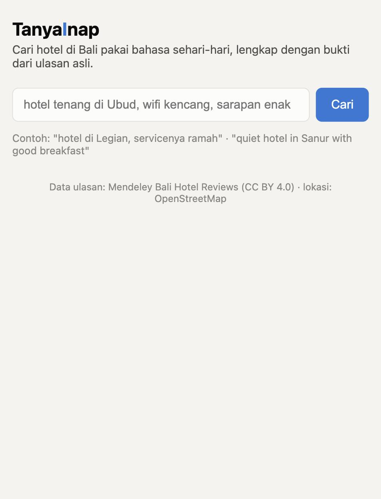
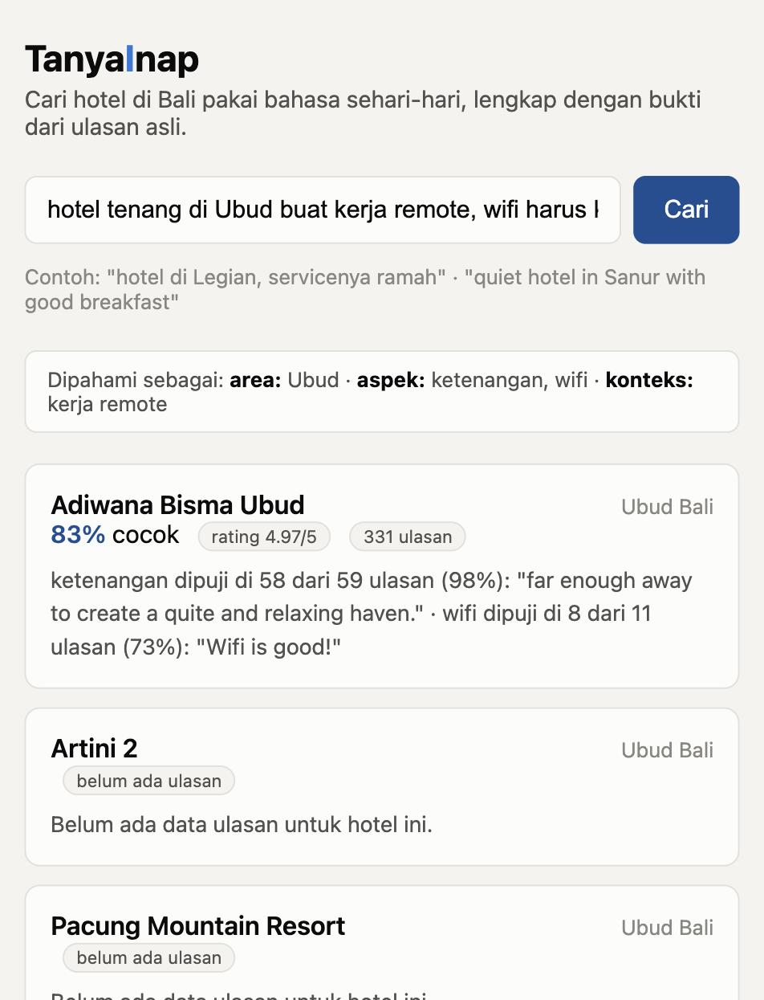
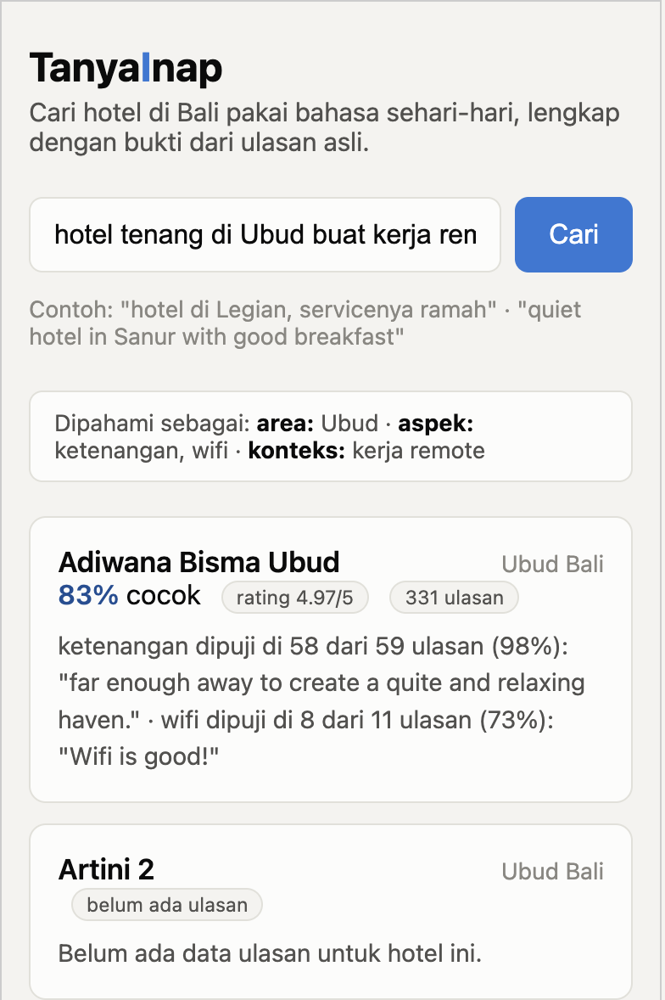

# TanyaInap

Natural language hotel search for Bali. Type what you actually need, in plain Indonesian or English, and get back hotels ranked by how well they fit, backed by real quotes from real reviews instead of a made up summary.

Try it: **https://tanyainap-610631276830.asia-southeast2.run.app**

## Why this exists

I'm applying for a Data Science role at Traveloka, and their job posting asks for exactly the kind of work I enjoy: turning messy natural language into structured data with LLMs, building ranking systems, and actually evaluating them properly instead of shipping a demo and calling it a day. Rather than writing a slide deck about that, I built a real, working product that does it.

The problem TanyaInap solves: hotel search is usually a wall of checkboxes (wifi: yes or no, breakfast: yes or no), but what people actually want to say is messier and more specific, something like "somewhere quiet in Ubud where I can actually get work done, with fast wifi." Even when you read the reviews yourself to check, nobody has time to read a hundred reviews per hotel. TanyaInap reads them for you. Instead of a summary it might have made up, it shows the real count and a real quote, so you can check the evidence yourself.

## Who this is for

Two honest answers:

- Anyone planning a trip to Bali who wants a straight answer about whether a hotel's wifi is actually fast or the room is actually quiet, backed by real reviews instead of a star rating that doesn't tell you much.
- Traveloka's hiring team. This project is a direct, working answer to the job posting: LLM based structured extraction, a ranker with real evaluation (NDCG, ablations against baselines, an honest LightGBM result), and Python/LGBM used in practice, not just listed on a resume.

Worth saying plainly: this covers a limited set of real Bali hotels, not the whole island, and there's no live pricing or booking. It's a focused demo built to prove the approach properly, not a finished commercial product.

## See it in action

**1. Ask in plain language, the way you'd ask a friend**



**2. Get ranked results with real evidence, not a guess**



The box at the top shows exactly how the query was understood (area, what you asked about, the context). Each hotel shows how many reviews actually mention what you asked for, and a real quote as proof.

**3. Works on a phone too**



## The numbers, not just a demo

A big part of the point here was not stopping at "it works," but actually measuring it, honestly, including the parts that didn't win.

| What was measured | Result |
|---|---|
| Aspect extraction accuracy, vs. IndoNLU's human labeled HoASA benchmark | 91.9% raw agreement, 0.856 macro F1 |
| Ranking quality (NDCG@10), MVP weighted score ranker | 0.992 |
| Same, sorted by star rating only | 0.867 |
| Same, keyword (TF-IDF) search | 0.753 |
| Same, embedding similarity only | 0.798 |
| LightGBM LambdaRank ranker, cross validated | 0.984, did **not** beat the simple weighted score |

That last row is reported as is on purpose. With about 1,000 labeled examples, a gradient boosted ranker doesn't have much room to learn reliable splits, and a well chosen weighted average can win. That is a real, useful finding, not a bug to hide.

Full detail, including a caught and explained metric artifact and the honest limits of how the ranking labels were produced, is in `reports/eval/` and `labeling/LABELING_METHOD.md`.

## Status

| Piece | Status |
|---|---|
| Data pipeline (extraction, aggregation) | Done. All 5,798 reviews processed. |
| Search (query understanding, ranking, web app) | Done, live at the URL above. |
| Evaluation (extraction accuracy, ranking ablation, LightGBM) | Done, real numbers above. |
| Real user testing | TBD, results will be added here once gathered. |

## Architecture

Offline, run once to prepare the data (see `scripts/`):

```
Mendeley Bali hotel reviews ──┐
                               ├──► LLM aspect extraction ──► per-hotel score aggregation
OpenStreetMap (location) ─────┘              │
                                              ▼
                                    data/processed/*.json, *.csv
                                    (baked into the deployed app)
```

Live, on every search:

```
Browser
  │  HTTPS
  ▼
FastAPI + a plain HTML/JS frontend (Cloud Run, scales to zero when idle)
  │
  ▼
Vertex AI (Gemini 3.1 Flash-Lite): parses the query into a structured filter
  │
  ▼
Ranker scores the pre-computed hotel data, no LLM call needed per hotel
```

- **LLM layer**: Vertex AI, not a plain API key. Google stopped letting new accounts spend free trial credit on the plain Gemini API after March 2026, but Vertex AI (on the same billing account) still works, and it also means the deployed service authenticates with its own service account instead of a key file sitting in an environment variable somewhere.
- **Data**: pre-computed offline, not queried live. The dataset doesn't change on its own, so there is no database, a redeploy is how the live data updates.
- **Safety nets on the live deploy**: 20 searches per hour per visitor, capped at one running instance (which also caps worst case cost), and a budget alert on the GCP billing account.

## Setup (local development)

```
git clone https://github.com/rafidhiyaulh/nginep.git
cd nginep
python3 -m venv .venv
.venv/bin/pip install -r requirements.txt
.venv/bin/pip install -e .

gcloud auth application-default login
gcloud auth application-default set-quota-project <your-gcp-project-with-vertex-ai-enabled>

.venv/bin/uvicorn app.main:app --reload --port 8000
```

Then open http://localhost:8000.

To rebuild the data from scratch, see the scripts in order: `scripts/build_hotel_table.py`, `scripts/extract_aspects.py`, `scripts/aggregate_hotel_aspects.py`.

## API

- `GET /api/search?q=<query>&top_k=10`: search, returns the parsed query plus ranked results with an evidence based explanation for each.
- `GET /api/health`: liveness check, also reports how much data is loaded.

`/api/search` is rate limited to 20 requests per hour per visitor on the live deployment.

## Known limitations

Said plainly, not buried:

- Only 16 hotels have real review data behind them. Thousands more are listed (from OpenStreetMap) so they still show up in the right area, but they're honestly marked "no review data yet" and never mixed into the ranked results.
- The review text is almost entirely in English even though a query can be in Indonesian. That is by design (the system reasons across languages), not an oversight, but it's worth knowing.
- Matching a query's area to a real place is mostly text based, not true geography. A few known gaps (like "Uluwatu" only being recognized as part of "Pecatu" in the data) are patched by hand, not solved generally.
- No live pricing or booking. A budget mentioned in a query is understood but can't actually filter anything yet.
- The ranking evaluation's relevance labels were produced with Claude's help, not independently verified by a human. That's disclosed in full in `labeling/LABELING_METHOD.md`, along with a recommendation to spot check a sample before treating the numbers as fully independent ground truth.

## License

Code: MIT, see [LICENSE](LICENSE). The datasets this project uses keep their own licenses (the Bali review dataset is CC BY 4.0, OpenStreetMap data is ODbL), see `data/raw/SOURCES.md` for the full breakdown and attribution.
