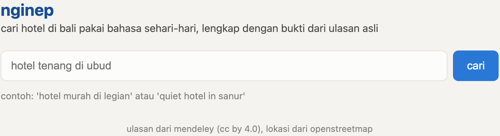
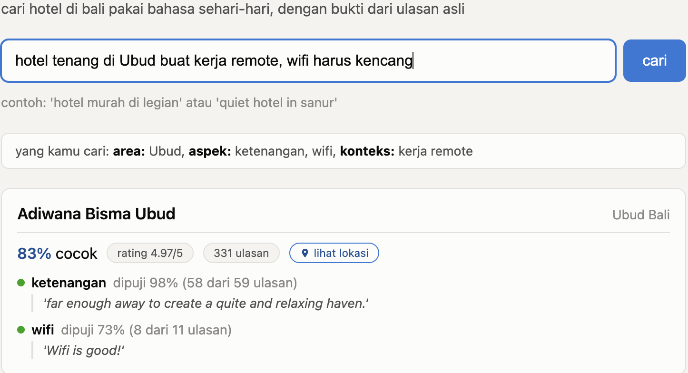

# TanyaInap

Natural language hotel search for Bali. Type what you need, get hotels ranked with real proof from real reviews.

Try it: **https://tanyainap-610631276830.asia-southeast2.run.app**

## Why this exists

I'm applying for a Data Science role at Traveloka. Their job posting asks for LLM based structured extraction, ranking, and real evaluation, not just a slide deck about it. So I built a real, working product instead.

Hotel search is usually checkboxes. What people actually want is more specific, like "quiet hotel in Ubud for remote work, fast wifi." Reading a hundred reviews yourself to check takes forever. TanyaInap does that reading for you, and shows the real quote as proof, not a made up summary.

## Who this is for

- Anyone planning a Bali trip who wants proof, not just a star rating.
- Traveloka's hiring team: this is the job posting's asks, working, not just listed on a resume.

Covers a limited set of real hotels, no live pricing or booking.

## See it in action

**1. Type what you need**

**2. Get proof, not guesses**

**3. Works on phone too**

## The numbers

| What | Result |
|---|---|
| Aspect extraction vs. human labeled benchmark (HoASA) | 91.9% agreement, 0.856 F1 |
| Ranking (NDCG@10), weighted score ranker | 0.992 |
| Same, sorted by star rating only | 0.867 |
| Same, keyword search | 0.753 |
| Same, embedding similarity only | 0.798 |
| LightGBM ranker, cross validated | 0.984, did not win |

That last row is reported honestly, not hidden. Full detail: `reports/eval/`.

## Known limitations

- Only 16 hotels have real review data. Others show up for the area but aren't ranked.
- Reviews are in English, queries can be Indonesian. By design.
- Area matching is text based, not true geography.
- No live pricing or booking yet.
- Ranking labels were Claude assisted, not independently human verified. See `labeling/LABELING_METHOD.md`.

## More

Technical details (architecture, setup, API): `docs/technical.md`. Code license: MIT. Data licenses: `data/raw/SOURCES.md`.
