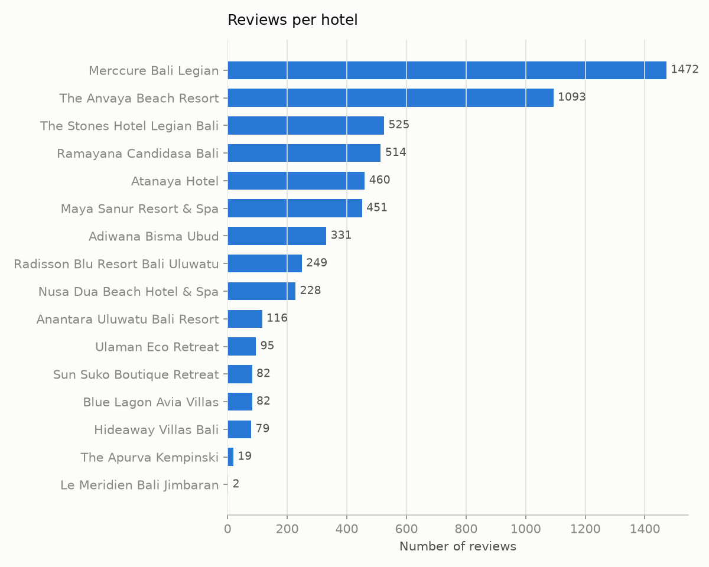
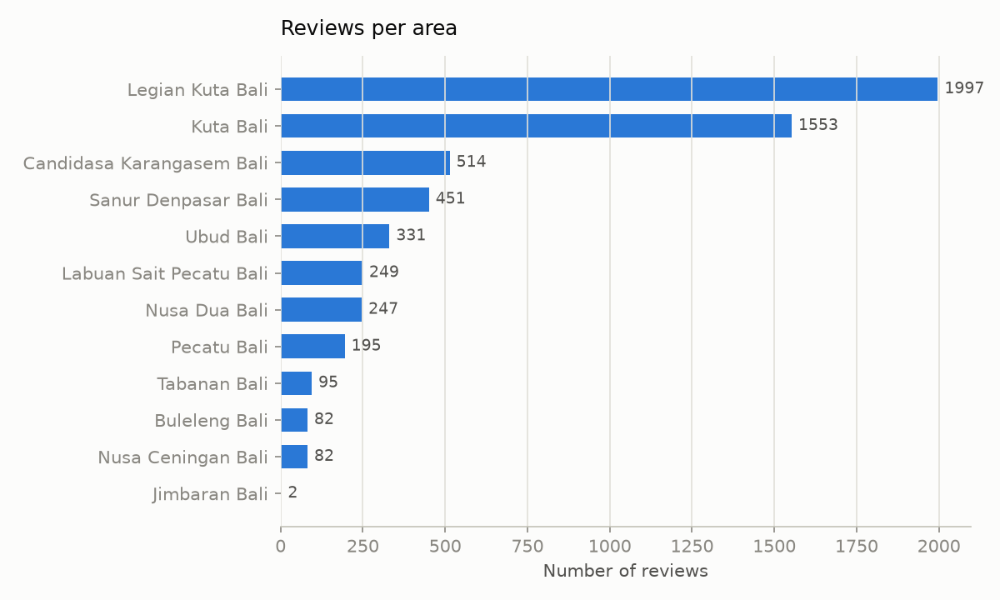
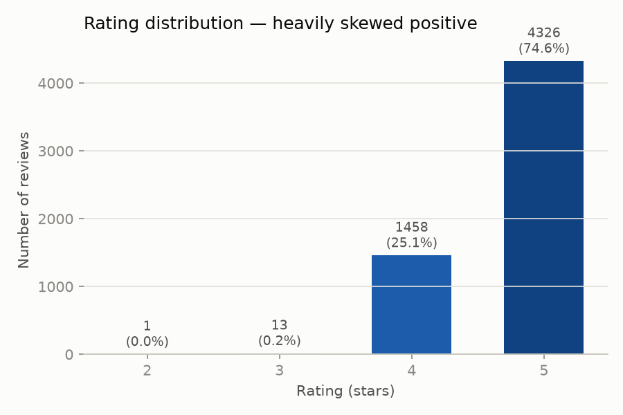
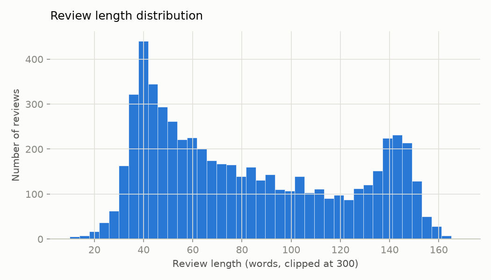
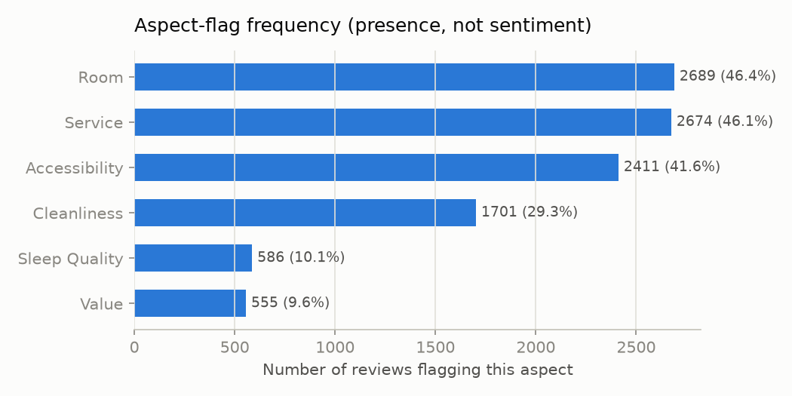

# EDA — Bali Hotel Reviews (Mendeley)

Generated by `scripts/run_eda.py`. Source data: `data/raw/bali_hotel_review.csv`
(see `data/raw/SOURCES.md` for provenance/license).

## Headline numbers

- **5,798 reviews** across **16 hotels** in **12 areas** of Bali.
- **99.8%** of reviews are 4–5 stars — very little negative signal to learn from.
- Median review length: **73 words**.
- Top 2 areas (Legian Kuta Bali + Kuta Bali) account for **61.2%** of all reviews — coverage is concentrated, not evenly spread across Bali.

## Reviews per hotel

Highly uneven: the top hotel alone (Merccure Bali Legian / a Mendeley-CSV typo for
Mercure) has more reviews than the bottom ~10 hotels combined. Any per-hotel
aspect score needs smoothing so low-review hotels don't get noisy extreme scores.

## Reviews per area

Ubud — the area used in this project's example query ("hotel tenang di Ubud
buat kerja remote") — has exactly one hotel in this dataset. See
`hotel_matching_log.md` and the project decision to supplement candidates
with OSM-listed hotels that have no review coverage, rather than pretending
Ubud has depth it doesn't.

## Rating distribution

TripAdvisor-style positivity skew, as expected. Only a handful of reviews are
3 stars or below — an aspect *sentiment* classifier trained/evaluated on this
corpus alone will barely see negative examples. The LLM extraction pipeline
should be evaluated with that in mind (e.g. don't claim strong negative-class
recall from a handful of examples).

## Review length

## Aspect-flag frequency

**Caveat (see `data/raw/SOURCES.md`): these six columns are binary
presence flags, not sentiment scores**, and the annotation method isn't
documented upstream. Treat this chart as "what reviewers tend to mention",
not "what hotels score well on" — that distinction matters for how far this
data can be trusted as eval ground truth versus the LLM extraction pipeline's
own output (which will be evaluated against a hand-labeled sample instead,
per the data audit notes).
